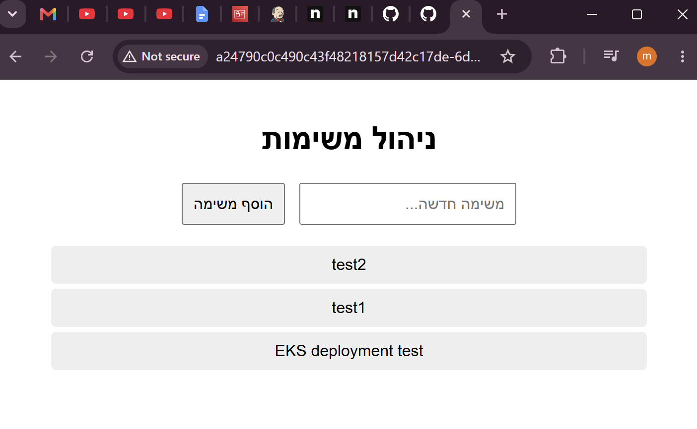
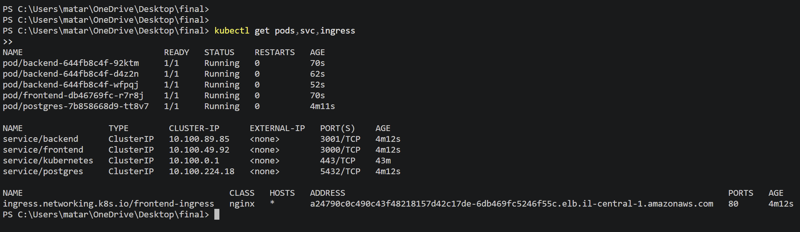
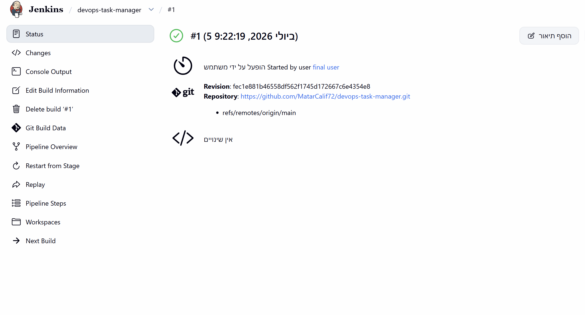
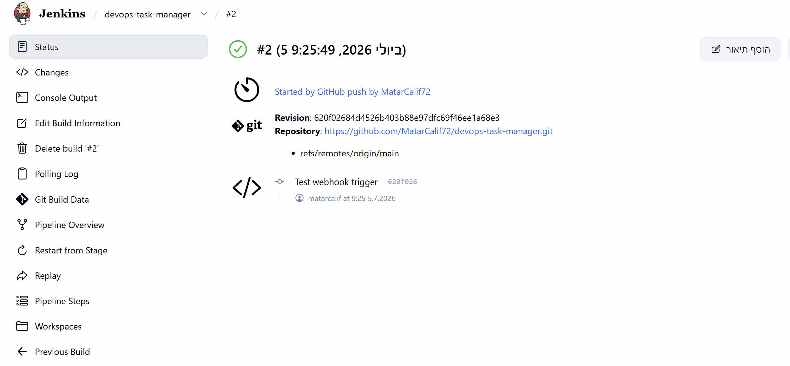
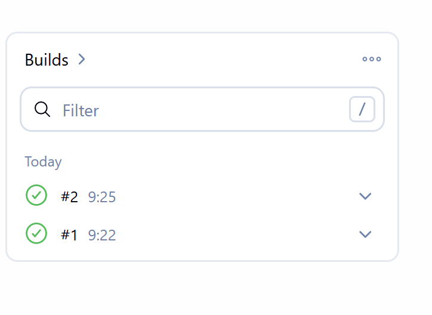

# DevOps Task Manager

A 3-tier task management app (frontend / backend API / Postgres) — forked from
[yehudits/devops-task-manager](https://github.com/yehudits/devops-task-manager) —
containerized, deployed to AWS EKS via Kubernetes, and built/deployed through a
Jenkins CI/CD pipeline triggered by GitHub webhooks.

See [CHANGES.md](./CHANGES.md) for a simple explanation of every change made
to the original app and why (in short: the frontend now forwards API
requests to the backend so the backend can stay private, and a crash bug in
the backend was fixed).

## Architecture

- **Frontend** (1 pod): serves the UI and proxies `/api/*` requests server-side
  to the backend. Only this component is exposed externally, via Ingress.
- **Backend** (3 pods): REST API, connects to Postgres. Never exposed
  externally — ClusterIP only. Readiness probe hits `/health`, which checks DB
  connectivity; the pod is marked not-ready (but stays running) if the DB is
  unreachable.
- **Postgres** (1 pod): backed by a PersistentVolumeClaim so task data
  survives pod restarts.
- **Ingress**: routes all traffic to the frontend only.

Secrets (DB credentials, internal backend URL) are stored as a Kubernetes
`Secret` (base64-encoded), never inlined in the Deployment manifests.

Rolling updates use `maxUnavailable: 0` / `maxSurge: 1` plus a `preStop` hook
on both frontend and backend containers, giving Service/Ingress endpoint
propagation time to catch up before a pod is killed — verified to produce
zero failed requests during a rollout.

## Repository layout

- `backend/`, `frontend/` — application source + Dockerfiles
- `docker-compose.yml` — local development stack
- `k8s/` — all Kubernetes manifests (Secret, PVC, Deployments, Services, Ingress)
- `Jenkinsfile` — CI/CD pipeline definition
- `CHANGES.md` — deviations from the original forked source, with rationale

## CI/CD pipeline

On every push to `main`, a GitHub webhook triggers a Jenkins pipeline that:

1. Builds the backend and frontend Docker images, tagged with the Jenkins
   build number (`vN`) — never overwriting previous versions.
2. Pushes both images to their AWS ECR repositories.
3. Updates the `backend` and `frontend` Deployments on EKS to the new image
   tags and waits for a zero-downtime rollout to complete.

## Running locally

```
docker compose up --build
```

App is available at `http://localhost:3000`.

## Deploying to Kubernetes (minikube or EKS)

```
kubectl apply -f k8s/
```

The same manifests work unmodified on both minikube (tested) and EKS
(tested) — EKS additionally requires the `aws-ebs-csi-driver` addon (for the
PVC) and an ingress controller (e.g. ingress-nginx), neither of which ship by
default on EKS.

## Screenshots

**App running and reachable from the browser, via Ingress:**



**`kubectl get pods,svc,ingress` — backend and postgres have no external IP,
confirming only the frontend is exposed:**



**Jenkins pipeline, build #1 (manually triggered, green):**



**Jenkins pipeline, build #2 (automatically triggered by a GitHub push via
webhook, green):**



**Jenkins build history overview:**


